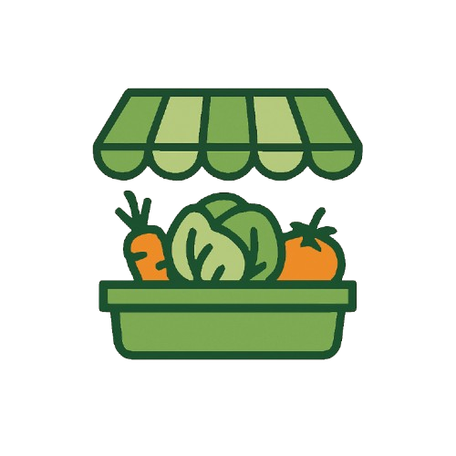

<div id="top">

<p align="center">



</p>

<p align="center">
  <em>Aplikasi pengelolaan produk pasar lokal dengan antarmuka modern dan fitur intuitif.</em>
</p>

<p align="center">
  <a href="https://github.com/Huntbase/Product-magang">
    
  </a>
  <a href="https://github.com/Huntbase/Product-magang/commits/main">
    
  </a>
  <a href="https://opensource.org/license/mit/">
    
  </a>
  <br />
  <a href="#">
    
  </a>
  <a href="#">
    
  </a>
  <a href="#">
    
  </a>
</p>

</div>


# 🛒 Pasar-Lokal

**Pasar-Lokal** adalah platform web yang dikembangkan dalam rangka kegiatan magang. Aplikasi ini bertujuan untuk memudahkan pengelolaan dan pencatatan produk di pasar lokal secara digital dan efisien.

Dirancang dengan antarmuka modern dan intuitif, aplikasi ini cocok digunakan oleh admin pasar atau pelaku UMKM untuk mengelola data produk dengan cepat.

---

## ✨ Fitur Utama

✅ Menampilkan daftar produk secara dinamis  
✅ Menambahkan, mengedit, dan menghapus produk  
✅ Navigasi antar halaman yang responsif  
✅ Komponen UI yang reusable dan modular  
✅ Struktur kode bersih dan mudah dipahami (cocok untuk pembelajaran)

---

## 🔧 Teknologi yang Digunakan

- ⚛️ React.js — Frontend library
- 🧰 JavaScript (ES6+)
- 📦 Node.js & NPM
- 🧹 ESLint — Penjaga kualitas kode
- 📁 Git & GitHub — Version Control

---

## 📂 Struktur Proyek

```text
Pasar-Lokal/
├── public/                 # File statis (HTML, ikon, dll)
├── src/                    # Folder utama kode sumber
│   ├── components/         # Komponen UI reusable
│   ├── pages/              # Halaman utama aplikasi
│   ├── App.js              # Root component React
│   └── index.js            # Entry point React
├── package.json            # Informasi project & dependensi
└── README.md               # Dokumentasi proyek
```

---

## 🚀 Cara Menjalankan Aplikasi

1. **Clone repositori**

   ```bash
   git clone https://github.com/Huntbase/Product-magang.git
   cd product-magang
   ```

2. Install dependensi

   ```bash
   npm install
   ```

3. Jalankan server pengembangan

   ```bash
   npm start
   ```

4. Buka di browser

   ```bash
   Akses aplikasi di http://localhost:3000 ataupun https://pasarlokal.netlify.app/
   ```

## 🙌 Kontribusi

Kontribusi sangat terbuka!
Jika kamu menemukan bug, ingin menambahkan fitur, atau memperbaiki dokumentasi:

1. Fork repositori ini

2. Buat branch baru (git checkout -b fitur-anda)

3. Commit perubahan (git commit -m 'Tambah fitur A')

4. Push ke branch (git push origin fitur-anda)

5. Buat Pull Request

## 📄 Lisensi

Proyek ini dikembangkan untuk keperluan pembelajaran dan magang. Bebas digunakan dengan mencantumkan atribusi.

```bash

Dibuat dengan ❤️ oleh tim Pasar-Lokal

```
