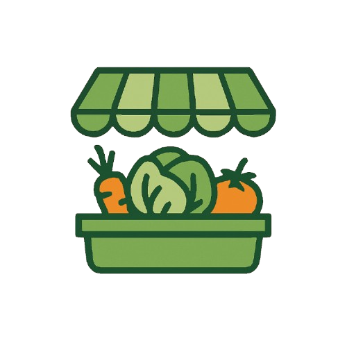

<div id="top">
<p align="center">
  
</p>
<h1 align="center">🛒 Pasar Lokal — Direktori & Manajemen Pasar Bogor</h1>
<p align="center">
  <em>Platform web direktori pasar tradisional Kota Bogor dengan dashboard pengelolaan produk, dikembangkan selama program magang di Dinas Koperasi dan UMKM Kota Bogor.</em>
</p>

<p align="center">
  <a href="https://github.com/Huntbase/pasar-lokal-directory">
    
  </a>
  <a href="https://github.com/Huntbase/pasar-lokal-directory/commits/main">
    
  </a>
  <br />
  
  
  
</p>
</div>

🔗 **Live Demo:** [pasarlokal.netlify.app](https://pasarlokal.netlify.app/)

---

## Latar Belakang

Dikembangkan selama program magang di **Dinas Koperasi dan UMKM Kota Bogor**, aplikasi ini dibangun untuk menggantikan proses pencatatan dan publikasi data pasar tradisional/minimarket yang sebelumnya tersebar dan manual, menjadi satu platform digital terpusat yang bisa diakses publik maupun dikelola oleh admin.

Aplikasi terdiri dari dua sisi:
- **Halaman publik** — direktori pasar yang bisa diakses siapa saja untuk mencari informasi pasar di Bogor
- **Dashboard admin** — panel pengelolaan data produk pasar (CRUD) untuk keperluan internal

---

## ✨ Fitur Utama

**Sisi Publik**
- Daftar pasar & minimarket dengan pagination dan filter berdasarkan wilayah (Bogor Tengah, Bogor Barat, Bogor Utara, dll.)
- Halaman detail per pasar (alamat, kategori, foto)
- Halaman kontak dan FAQ
- Halaman profil platform

**Dashboard Admin**
- Menambahkan, mengedit, dan menghapus data produk
- Menampilkan daftar produk secara dinamis

**Umum**
- Navigasi antar halaman yang responsif
- Komponen UI reusable dan modular

---

## 🔧 Teknologi yang Digunakan

- React.js — Frontend library
- JavaScript (ES6+)
- Node.js & NPM
- Git & GitHub — Version Control
- Netlify — Deployment

---

## 📂 Struktur Proyek

```text
pasar-lokal-directory/
├── public/                 # File statis (HTML, ikon, dll)
├── src/
│   ├── components/         # Komponen UI reusable
│   ├── pages/              # Halaman utama aplikasi (Home, Dashboard, Detail, Kontak, Profile)
│   ├── App.js
│   └── index.js
├── package.json
└── README.md
```

---

## 🚀 Cara Menjalankan Aplikasi

```bash
git clone https://github.com/[github-username]/pasar-lokal-directory.git
cd pasar-lokal-directory
npm install
npm start
```

Akses di `http://localhost:3000`, atau lihat versi live di [pasarlokal.netlify.app](https://pasarlokal.netlify.app/).

---

## Kontribusi Saya

Proyek ini dikerjakan **solo** selama masa magang. Scope pekerjaan individual saya mencakup seluruh fitur di atas: Dashboard, Home, Kontak, Profile, dan Detail tiap Pasar.

---

## Lisensi

Proyek ini dikembangkan untuk keperluan magang di Dinas Koperasi dan UMKM Kota Bogor. Hak penggunaan kode mengikuti ketentuan instansi terkait — hubungi untuk keperluan penggunaan lebih lanjut.

---

<p align="center"><em>Dibuat oleh Benediktus Mikael Auwdinata</em></p>
